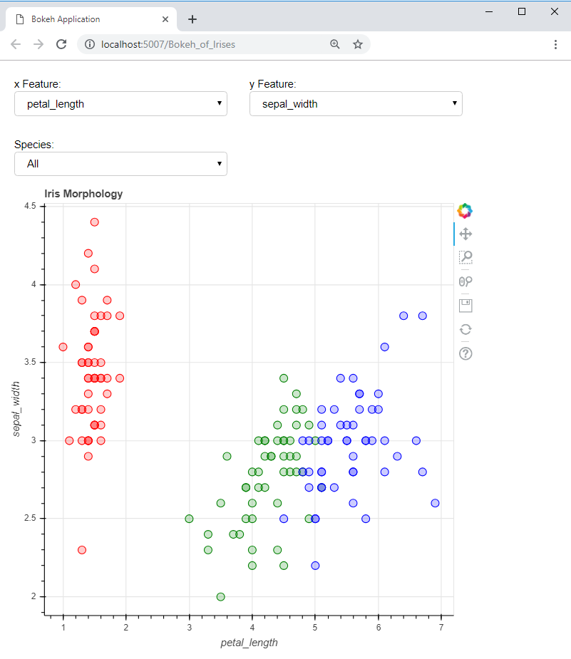

# Bokeh of Irises

1. Example for obtaining a Bokeh output within a jinja template
* Notebook: [Static Bokeh document from a template](./Static_Bokeh_from_a_template.ipynb)

  * Templating with jinja2
  * Selective use of `bokeh.resources.CDN`, but could be custom ones defined in the `irises/static/` folder.

2. Bokeh served html document example
* Notebook: [Served interactive Bokeh document](./Served_interactive_Bokeh.ipynb)  

To run:
```cd irises
   bokeh serve --show Bokeh_of_Irises.py
```

#### A new browser tab will open with the application running at:
```http://localhost:[port]/Bokeh_of_Irises```, where [port] is usually 5006

** This screenshot show the final layout**:
The X and Y axes data are controlled by the "`. Feature:`" selection boxes and the filtering is done by the `Species` box:  

<div style="width:400px;height:300px;padding:10px;">
    

</div>


### Requirements:

* Python libraries requiring installation:
bokeh=1.0.4
python>3.5

* Local modules:
utils.py